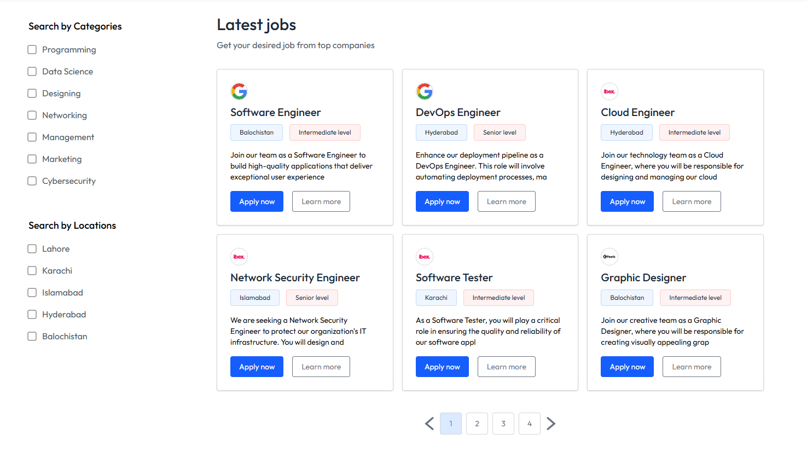
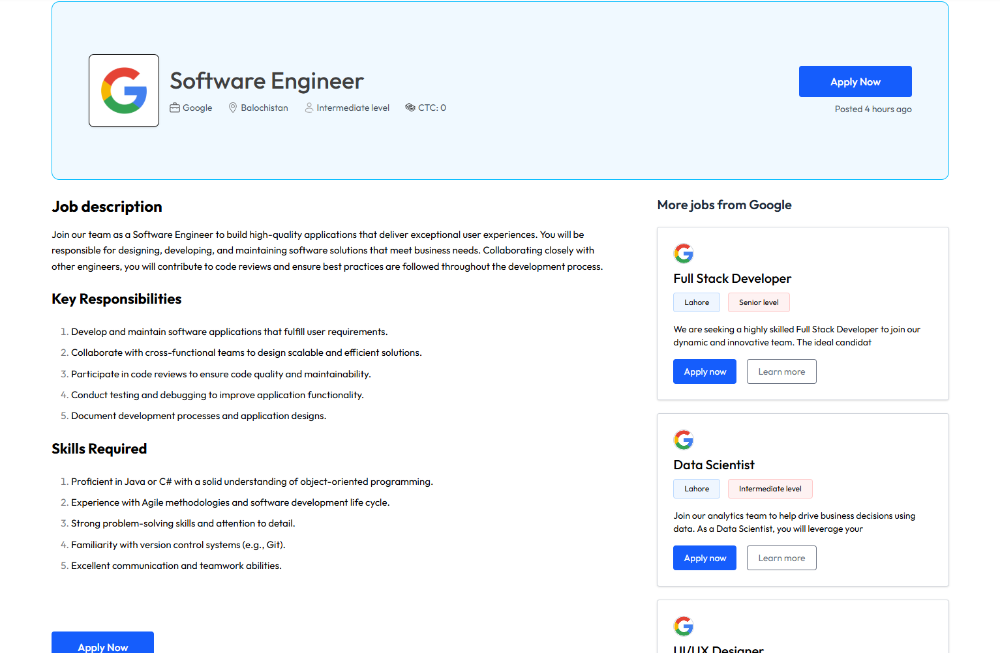
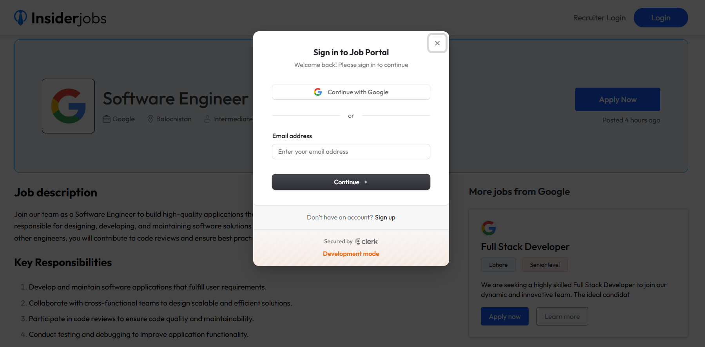

# 🚀 MERN Job Portal - Full Stack Recruitment Platform

<div align="center">


**A Modern, Production-Ready Job Board & Recruitment Management System**

</div>

---

## 📋 Table of Contents

- [Overview](#-overview)
- [Key Features](#-key-features)
- [Tech Stack](#️-tech-stack)
- [Screenshots](#-screenshots)
- [Getting Started](#-getting-started)
- [Installation](#️-installation)
- [Environment Variables](#-environment-variables)
- [Project Structure](#-project-structure)
- [API Documentation](#-api-documentation)
- [Contributing](#-contributing)
- [License](#-license)
- [Author](#author)

---

## 🌟 Overview

**MERN Job Portal** is a comprehensive full-stack web application built with the MERN stack (MongoDB, Express.js, React, Node.js). This modern job board platform connects job seekers with employers, featuring an intuitive interface for job postings, applications, and recruitment management.

### 🎯 Perfect For:
- Job seekers looking for opportunities
- Companies posting job openings
- HR departments managing recruitment
- Freelancers and recruiters
- Career development platforms

---

## ✨ Key Features

### 👥 For Job Seekers
- ✅ **Browse Jobs** - Search and filter through thousands of job listings
- 📄 **Easy Applications** - One-click apply with resume upload
- 📊 **Application Tracking** - Monitor application status in real-time


### 🏢 For Recruiters/Companies
- 📝 **Post Jobs** - Create detailed job postings with rich text editor
- 👨‍💼 **Manage Applications** - Review, accept, or reject candidates
- 📈 **Dashboard Analytics** - Track job performance and applicants
- 🔒 **Secure Authentication** - Protected recruiter dashboard

### 🎨 User Experience
- 📱 **Fully Responsive** - Works seamlessly on all devices
- 🌓 **Modern UI/UX** - Clean, professional interface with Tailwind CSS
- ⚡ **Fast Performance** - Optimized loading and smooth transitions
- 🔍 **Advanced Search** - Filter by location, category, level, salary
- 📦 **File Management** - Resume upload and download functionality

---

## 🛠️ Tech Stack

### Frontend
- **React 18** - Modern UI library
- **React Router** - Client-side routing
- **Tailwind CSS** - Utility-first styling
- **Lucide React** - Beautiful icons
- **Axios** - HTTP client
- **React Toastify** - Toast notifications
- **Quill** - Rich text editor
- **Clerk** - User authentication
- **Moment.js** - Date formatting

### Backend
- **Node.js** - Runtime environment
- **Express.js** - Web framework
- **MongoDB** - NoSQL database
- **Mongoose** - ODM library
- **JWT** - Token-based authentication
- **Bcrypt** - Password hashing
- **Multer** - File upload handling
- **CORS** - Cross-origin resource sharing

### Development Tools
- **Vite** - Fast build tool
- **ESLint** - Code linting
- **Git** - Version control
- **Vercel** - Deployment platform

---

## 📸 Screenshots

### 🏠 Home Page

*Landing page with hero section*

### 💼 Job Listings

*Browse and filter available job opportunities*

### 📋 Applied Jobs 


### 👤 User Login

*Secure authentication for job seekers*

### 🏢 Recruiter Login

*Company authentication portal*

### ➕ Add Job (Recruiter)

*Post new job openings with rich text editor*

### 🗂️ Manage Jobs (Recruiter)

*View and manage all posted jobs*

### 👥 View Applications (Recruiter)

*Review and manage candidate applications*

---

## 🚀 Getting Started

### Prerequisites
- Node.js (v16 or higher)
- MongoDB (local or Atlas)
- npm or yarn package manager

### Quick Start
```bash
# Clone the repository
git clone https://github.com/ARQUM21/mern-job-portal.git

# Navigate to project directory
cd mern-job-portal

# Install dependencies for both frontend and backend
cd client && npm install
cd ../server && npm install

# Set up environment variables (see below)

# Run development servers
# Terminal 1 - Backend
cd server && npm run dev

# Terminal 2 - Frontend
cd client && npm run dev
```

Visit `http://localhost:5173` for frontend and `http://localhost:4000` for backend.

---

## ⚙️ Installation

### Backend Setup

1. Navigate to server directory:
```bash
cd server
```

2. Install dependencies:
```bash
npm install
```

3. Create `.env` file:
```env
MONGODB_URI=your_mongodb_connection_string
JWT_SECRET=your_jwt_secret_key
PORT=4000
CLOUDINARY_NAME=your_cloudinary_name
CLOUDINARY_API_KEY=your_cloudinary_api_key
CLOUDINARY_API_SECRET=your_cloudinary_api_secret
```

4. Start server:
```bash
npm run dev
```

### Frontend Setup

1. Navigate to client directory:
```bash
cd client
```

2. Install dependencies:
```bash
npm install
```

3. Create `.env` file:
```env
VITE_BACKEND_URL=http://localhost:4000
VITE_CLERK_PUBLISHABLE_KEY=your_clerk_key
```

4. Start development server:
```bash
npm run dev
```

---

## 🔐 Environment Variables

### Backend (.env)
```env
# Database
MONGODB_URI=your_mongodb_link

# Authentication
JWT_SECRET=your_super_secret_jwt_key_here

# Server
PORT=4000
NODE_ENV=development

# File Upload (Cloudinary)
CLOUDINARY_CLOUD_NAME=your_cloud_name
CLOUDINARY_API_KEY=your_api_key
CLOUDINARY_API_SECRET=your_api_secret
```

### Frontend (.env)
```env
# Backend API
VITE_BACKEND_URL=http://localhost:4000

# Clerk Authentication
VITE_CLERK_PUBLISHABLE_KEY=pk_test_your_clerk_key
```

---

## 📁 Project Structure
```
mern-job-portal/
├── client/                  # Frontend React application
│   ├── public/             # Static assets
│   ├── src/
│   │   ├── assets/         # Images, icons, data
│   │   ├── components/     # Reusable components
│   │   │   ├── Navbar.jsx
│   │   │   ├── Footer.jsx
│   │   │   ├── JobCard.jsx
│   │   │   └── ...
│   │   ├── pages/          # Page components
│   │   │   ├── Home.jsx
│   │   │   ├── ApplyJob.jsx
│   │   │   ├── Applications.jsx
│   │   │   └── Dashboard/
│   │   ├── context/        # React context
│   │   ├── App.jsx         # Main app component
│   │   └── main.jsx        # Entry point
│   ├── package.json
│   └── vite.config.js
│
├── server/                  # Backend Node.js application
│   ├── controllers/        # Request handlers
│   │   ├── companyController.js
│   │   ├── jobController.js
│   │   └── userController.js
│   ├── models/             # Database models
│   │   ├── Company.js
│   │   ├── Job.js
│   │   ├── Application.js
│   │   └── User.js
│   ├── routes/             # API routes
│   │   ├── companyRoutes.js
│   │   ├── jobRoutes.js
│   │   └── userRoutes.js
│   ├── middleware/         # Custom middleware
│   │   └── authMiddleware.js
│   ├── config/             # Configuration files
│   │   └── db.js
│   ├── server.js           # Entry point
│   └── package.json
│
└── README.md               # You are here!
```

---

## 🔌 API Documentation

### Authentication Endpoints

#### User Authentication (Clerk)
```http
POST /api/users/register
POST /api/users/login
GET /api/users/profile
PUT /api/users/update-resume
```

#### Company Authentication
```http
POST /api/company/register
POST /api/company/login
```

### Job Endpoints
```http
GET /api/jobs              # Get all jobs
GET /api/jobs/:id          # Get single job
POST /api/jobs             # Create job (Auth required)
PUT /api/jobs/:id          # Update job (Auth required)
DELETE /api/jobs/:id       # Delete job (Auth required)
```

### Application Endpoints
```http
GET /api/applications           # Get user applications
POST /api/applications/:jobId   # Apply for job
PUT /api/applications/:id       # Update status (Recruiter only)
```

---

## 🤝 Contributing

Contributions are what make the open-source community amazing! Any contributions you make are **greatly appreciated**.

1. Fork the Project
2. Create your Feature Branch (`git checkout -b feature/AmazingFeature`)
3. Commit your Changes (`git commit -m 'Add some AmazingFeature'`)
4. Push to the Branch (`git push origin feature/AmazingFeature`)
5. Open a Pull Request

---

## 📝 License

Distributed under the MIT License. See `LICENSE` for more information.

---

## Author

**Muhammad Arqum**

<div align="center">

[](https://github.com/ARQUM21)
[](https://www.linkedin.com/in/muhammadarqumtariq/)
[](mailto:marqum987@gmail.com)

</div>

---

## Acknowledgments

- [React Documentation](https://react.dev)
- [MongoDB Documentation](https://docs.mongodb.com)
- [Tailwind CSS](https://tailwindcss.com)
- [Lucide Icons](https://lucide.dev)
- [Clerk Authentication](https://clerk.com)

---

<div align="center">
  


</div>

---

<div align="center">

### ⭐ Star this repository if you found it helpful!

Made with ❤️ by [Muhammad Arqum](https://github.com/ARQUM21)

</div>
